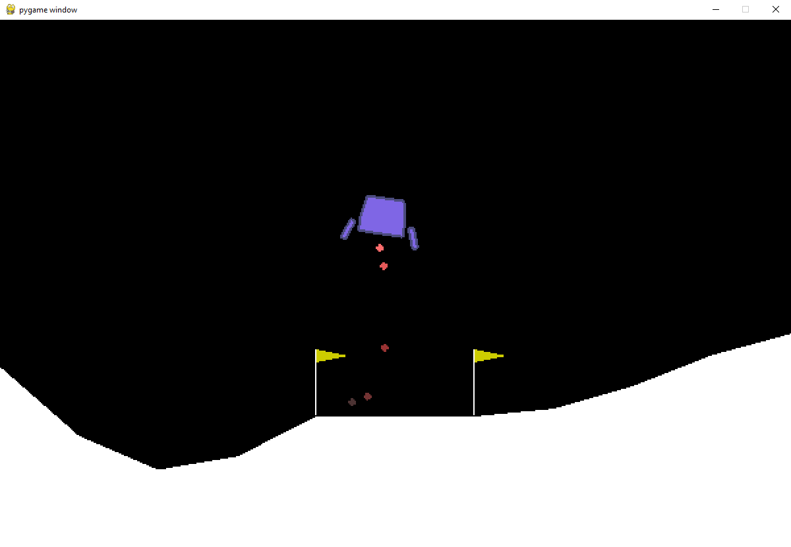

# Demo for [On Optimizing Interventions For Shared Autonomy](https://github.com/DavidKoleczek/human_marl)

A script that lets you play Lunar Lander with one of our agents assisting you. 

Press "W" to fire the main engine, "A" to fire the left engine, and "D" to fire the right engine.

A red box in the top right corner indicates that the agent is overriding your action.



## Installation
In general, to run `keyboard_agent.py` requires:
- A Python 3.8 environment
```
python -m venv ".\env" 
.\env\Scripts\activate
python -m pip install --upgrade pip setuptools wheel
```
- PyTorch 1.8+, such as with this command 

```
pip3 install torch==1.8.1+cpu torchvision==0.9.1+cpu torchaudio===0.8.1 -f https://download.pytorch.org/whl/torch_stable.html
```

- Install all the packages in `requirements.txt`
```
pip install -r requirements.txt
```


### Windows
For Windows, we include a batch script to install the environment for you, assuming you have Python 3 on your path available as ``python``.

To install the Python environment in the current directory run
```
create_env.bat
```
From there as long as the environment is activated (with `.\env\Scripts\activate`) you can run the command in the below section to play the game)

## Usage

To play Lunar Lander with our agents, you can run the following command
```
python keyboard_agent.py --trained_agent_type 1 --zoom_level 2
```
`trained_agent_type` determines which autonomous agent will be assisting you. 
- 0: no assistance (vanilla lunar lander)
- 1: the "best" agent, trained with a "sensor" human and intervention penalty of 1
- 2: trained with a "noisy" human and intervention penalty of 0.15
- 3: trained with "noisy" human and intervention penalty of 0.75
- 4: Ensemble of 1, 2, and 3. i.e. an action is sampled uniformly randomly from one of those agents at each timestep

Adjust `zoom_level` if the image is too small or too big (smaller number means smaller image)

**NOTE**: If you reach the goal, the game might not reset for a while, so just re-run the script in this case.
